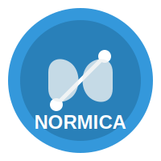

# 📘 Normica

Normica to inteligentny asystent chatbot specjalizujący s    ├── advanced_tools.py  # Zaawansowane narzędzia wyszukiwania
└── utils/           # Komponenty przetwarzania dokumentów
    ├── advanced_chunking.py  # Funkcja chunk_markdown_by_header
    ├── vector_store.py       # Zarządzanie bazą wektorową FAISS normie EN 301 549 dotyczącej dostępności ICT (Information and Communication Technology). Wykorzystuje modele LLM (np. GPT-4o-mini) przez LangChain do zapewnienia dokładnych i pomocnych odpowiedzi na pytania dotyczące standardów dostępności.



**Repozytorium:** [github.com/JacZad/normica](https://github.com/JacZad/normica)
---
## 🌟 Interfejs Streamlit


### Funkcje interfejsu webowego

- **Intuicyjny interfejs chatbota** – łatwe zadawanie pytań i czytelne odpowiedzi
- **Historia konwersacji** – zapisywanie całej rozmowy w ramach sesji
- **Responsywny design** – dostosowuje się do różnych urządzeń

### Uruchamianie

```bash
streamlit run app.py
```

Aplikacja będzie dostępna pod adresem: `http://localhost:8501`

### Najczęstsze problemy

- Upewnij się, że masz ustawiony klucz API OpenAI (`OPENAI_API_KEY`)
- Sprawdź, czy zainstalowałeś wszystkie wymagane pakiety (`pip install -r requirements.txt`)
- Jeśli pojawią się błędy, sprawdź logi w konsoli lub otwórz [issue na GitHub](https://github.com/JacZad/normica/issues)

---
---

## 🌟 Funkcje

- **Kompleksowa wiedza o normie EN 301 549** – uzyskaj odpowiedzi na pytania dotyczące wymagań dostępności ICT
- **Inteligentny chunking Markdown** – zaawansowany system przetwarzania dokumentów z zachowaniem hierarchii
- **Obliczanie wielkości czcionki** – automatyczne obliczanie zalecanej wysokości czcionki na podstawie odległości obserwacji
- **Podawanie aktualnej daty** – narzędzie dostępne dla użytkownika
- **Konwersacja w języku naturalnym** – zadawaj pytania w zwykłym języku polskim
- **Pamięć kontekstowa** – chatbot pamięta wcześniejsze części rozmowy
- **Interfejs webowy** – całość obsługiwana przez Streamlit

---

## 📦 Najważniejsze foldery

```
normica/
├── app.py                # Główna aplikacja Streamlit
├── requirements.txt      # Wymagania
├── src/
│   ├── chatbot/         # Logika chatbota i narzędzia
│   ├── config/          # Konfiguracja
│   └── utils/           # Chunking, baza wektorowa
└── docs/                # Dokumentacja
```

## 🏗️ Architektura projektu

### Główne komponenty

```
src/
├── config/          # Konfiguracja aplikacji
│   └── settings.py  # Ustawienia, modele LLM, ścieżki
├── chatbot/         # Logika chatbota
│   ├── normica_bot.py     # Główna klasa chatbota
│   ├── tools.py           # Podstawowe narzędzia
│   └── advanced_tools.py  # Zaawansowane narzędzia wyszukiwania
└── utils/           # Komponenty przetwarzania dokumentów
    ├── advanced_chunking.py  # MarkdownChunker i HybridChunker
    ├── vector_store.py       # Zarządzanie bazą wektorową FAISS
    ├── chunking_analyzer.py  # Analiza jakości chunkingu (opcjonalne)
    └── chunking_optimizer.py # Optymalizacja parametrów (opcjonalne)
```

### Główne klasy i funkcje

- **`NormicaChatbot`** - główny chatbot z obsługą narzędzi i RAG
- **`chunk_markdown_by_header`** - funkcja dzieląca dokumenty markdown do poziomu nagłówka H4
- **`VectorStoreManager`** - zarządzanie bazą wektorową FAISS

## 🚀 Rozpoczęcie pracy

### Wymagania wstępne

- Python 3.8+
- Klucz API OpenAI (ustaw jako zmienną środowiskową `OPENAI_API_KEY`)

---

### Instalacja

1. Sklonuj repozytorium lub utwórz nowy projekt
2. Zainstaluj wymagane pakiety:

```bash
pip install -r requirements.txt
```

3. Ustaw klucz API OpenAI jako zmienną środowiskową:

```bash
# W PowerShell:
$env:OPENAI_API_KEY="twój-klucz-api"

# W CMD:
set OPENAI_API_KEY=twój-klucz-api
 
# W systemie macOS/Linux:
export OPENAI_API_KEY=twój-klucz-api
```

### Uruchomienie

```bash
streamlit run app.py
```

Po uruchomieniu interfejs webowy będzie dostępny pod adresem: `http://localhost:8501`

---

## 💬 Przykłady użycia

- "Co to jest norma EN 301 549?"
- "Jaka jest dzisiaj data?"
- "Jaka powinna być wielkość czcionki dla odległości 600 mm?"
- "Oblicz wysokość tekstu dla ekranu w odległości 800 mm."

---

## 🔧 System chunkingu

Normica używa zaawansowanego systemu chunkingu specjalnie zaprojektowanego dla dokumentów Markdown:

### Funkcja `chunk_markdown_by_header`

- **Hierarchiczna struktura** - respektuje nagłówki Markdown od H1 do H4 (`#`, `##`, `###`, `####`)
- **Dzielenie dokumentu** - podział tekstu na mniejsze fragmenty ułatwiające wyszukiwanie
- **Bogate metadane** - zachowuje informacje o strukturze dokumentu

---

## 🧮 Wzór na obliczanie wielkości czcionki

Normica używa następującego wzoru do obliczania zalecanej wysokości czcionki:

```math
wysokość x (mm) = odległość(mm) * 2.2 / 180
```

Gdzie:

- **wysokość x** to minimalna wysokość dużej litery H w milimetrach
- **odległość** to typowa odległość obserwacji w milimetrach

## ✅ Lista narzędzi

### Zaimplementowane

- [x] `font_size_calculator` – obliczanie zalecanej wysokości czcionki na podstawie odległości obserwacji
- [x] `get_current_date` – zwracanie aktualnej daty
- [x] `norm_search` – wyszukiwanie w treści normy EN 301 549

---
## 🤝 Contributing

Chcesz zgłosić błąd lub dodać funkcję? Otwórz [issue](https://github.com/JacZad/normica/issues) lub stwórz pull request!

## 📄 License

Projekt udostępniany na licencji MIT. Szczegóły w pliku LICENSE.

### Propozycje kolejnych narzędzi

- [ ] `requirement_explainer` – wyjaśnianie i interpretacja wybranego wymagania normy
- [ ] `clause_comparator` – porównywanie wymagań pomiędzy różnymi wersjami normy
- [ ] `norm_reference_generator` – generowanie cytatów i odwołań do konkretnych punktów normy
- [ ] `checklist_builder` – tworzenie listy kontrolnej na podstawie wybranych rozdziałów normy
- [ ] `report_template_creator` – generowanie szablonów raportów zgodnych z EN 301 549

## 🛠️ Rozszerzanie funkcjonalności

Aby dodać nowe narzędzia do chatbota:

1. Zdefiniuj nową funkcję z dekoratorem `@tool` w `src/chatbot/tools.py`
2. Dodaj ją do listy `self.tools` w klasie `NormicaChatbot`
3. Zaktualizuj prompt systemowy, aby informował o nowej funkcjonalności

## 📄 Licencja

Ten projekt jest udostępniany na licencji MIT.